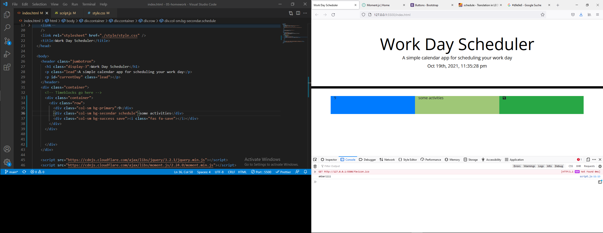
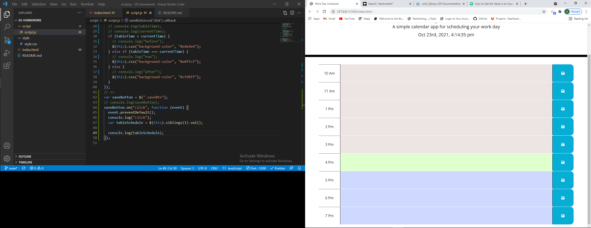
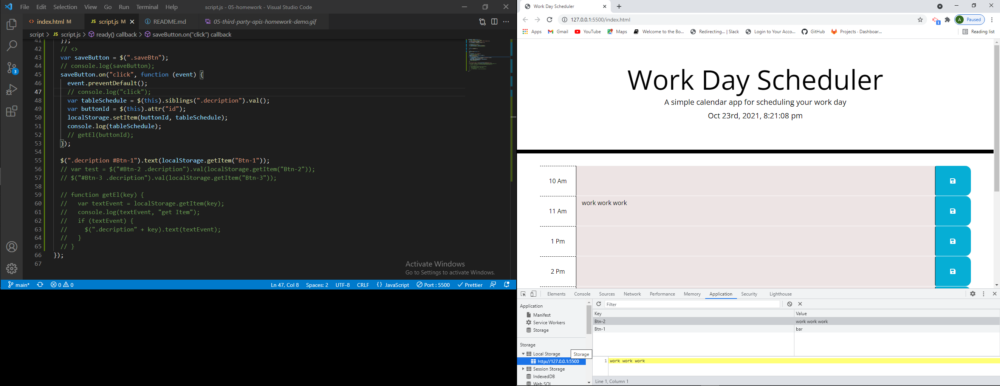

# < Title: Work Day Scheduler>

## Description

It is a simple and effective code to represent a daily calender. Showing the actual time at each day the user is able to see her/his calender, simply by adding the task in rows. The coloring may help the user to have a better perception of daily activities.

## Technical issues

The code consists of two main parts, the header and the calender. The upper one works by the aid of moment function and the lower one uses the bootstrap table, a function to color the rows comparing to current time and another one to save the selected schedule in local storage. The main syntax is based on jquary selectors thats why we see each instead of for $ instead of getElement and so on. Clicking each save button the code reads the content of sibling of this button and the id of this button we use these two variables later to feed the key and value of localStorage.setItem. Later on we have to get the localstorage Item back to value of decription class to make the user able to see her/his schedule after refreshing the page.

## List of screenshots

